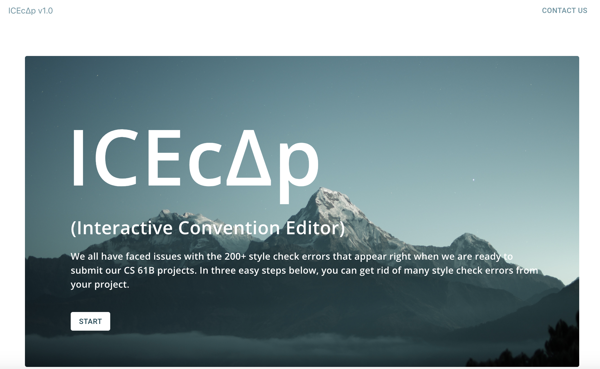
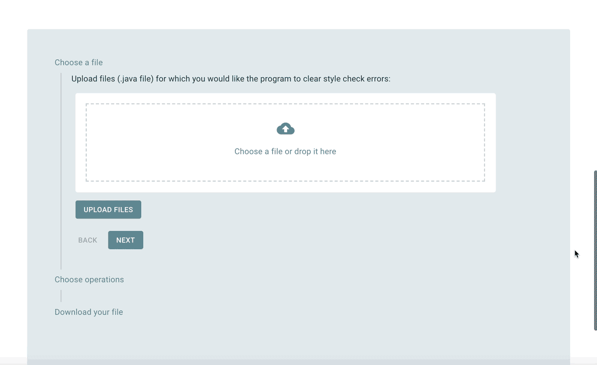
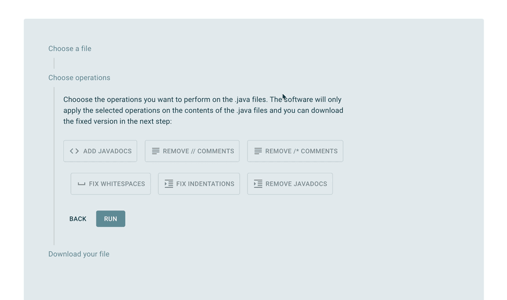
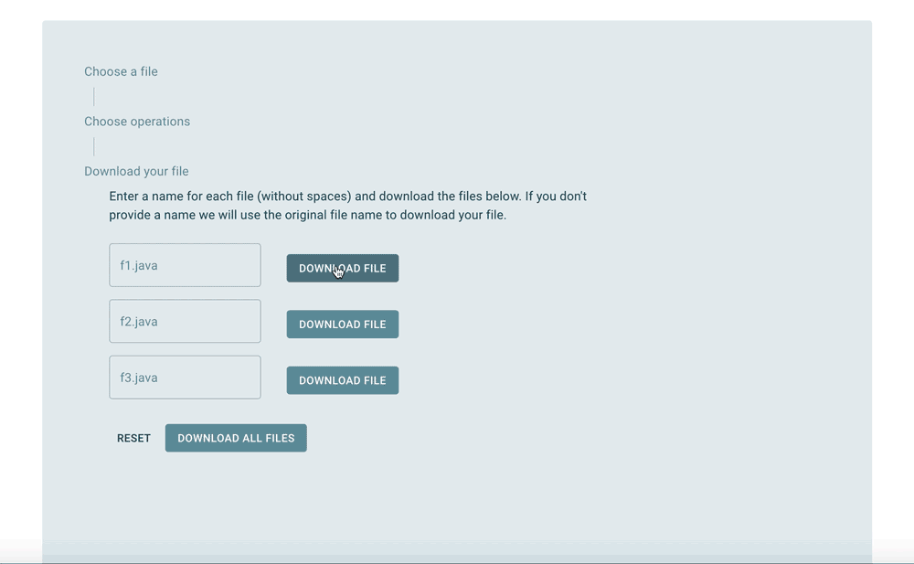

# ICEcΔp
 An interactive java style/convention editor, based on the guidelines as specified in the course CS 61B.
 The application is made using Flutter, and both the backend and UI are written in Dart. 
 Users can upload .java files and choose certain editing filters to be applied so that the code in those files can fit certain style parameters. 
 
 ## preliminary interface:
 
 **Homepage**: 
  
 
 **Uploading files**: 
   
 
 **Choose which operations to apply**: 
  
 
 **Downloading a file**: 
 
